# BookMe

**Aplikacja webowa do umawiania wizyt w salonach fryzjerskich, kosmetycznych i punktach masażu - z wyszukiwarką usług na mapie, kreatorem rezerwacji, opiniami ze zdjęciami oraz panelami właściciela i administratora (w stylu Booksy/Fresha).**

| | |
|---|---|
| **Uczelnia** | Uniwersytet Rzeszowski - Instytut Informatyki |
| **Kierunek** | Informatyka, II rok |
| **Przedmiot** | Aplikacje Internetowe (2025/2026) |
| **Prowadzący** | mgr inż. Jakub Jakielaszek |
| **Autorzy** | Radosław Misiołek - 134950<br>Wiktor Zięba - 134992 |
| **Miejsce, rok** | Rzeszów, 2026 |

---

## Spis treści
1. [O aplikacji](#1-o-aplikacji)
2. [Stos technologiczny](#2-stos-technologiczny)
3. [Architektura rozwiązania](#3-architektura-rozwiązania)
4. [Model danych](#4-model-danych)
5. [Wyszukiwarka usług](#5-wyszukiwarka-usług)
6. [Rezerwacja wizyty](#6-rezerwacja-wizyty)
7. [Opinie i zdjęcia](#7-opinie-i-zdjęcia)
8. [Role i panele](#8-role-i-panele)
9. [Przegląd interfejsu](#9-przegląd-interfejsu)
10. [Instalacja i uruchomienie](#10-instalacja-i-uruchomienie)
11. [Konfiguracja](#11-konfiguracja)
12. [Ograniczenia](#12-ograniczenia)
13. [Scenariusze testowe](#13-scenariusze-testowe)
14. [Podział pracy](#14-podział-pracy)

---

## 1. O aplikacji

BookMe to aplikacja webowa, w której klient w kilka chwil **znajduje usługę i rezerwuje wizytę** w salonie - fryzjerskim, barberskim, kosmetycznym, paznokciowym, masażu lub stylizacji brwi i rzęs. Sercem aplikacji jest **wyszukiwarka po usługach** (a nie po lokalach), pokazująca od razu dostępność terminów, z filtrami i mapą OpenStreetMap.

Aplikacja obsługuje trzy role: **klient** (rezerwuje, ocenia), **właściciel** (zarządza swoim salonem, pracownikami, kalendarzem) oraz **administrator** (zatwierdza zgłoszone lokale, moderuje treści). Interfejs jest w całości **w języku polskim**.

**Najważniejsze funkcje:**
- wyszukiwarka usług z **mapą OSM**, filtrami (kategoria, cena, zakres dat i godzin, ocena, obszar mapy), sortowaniem i paginacją,
- strona główna z najpopularniejszymi lokalami sortowanymi **średnią ważoną (bayesowską)**,
- strona lokalu z usługami, galerią, portfolio pracowników, opiniami i lokalizacją na mapie,
- **kreator rezerwacji** (usługa → termin → potwierdzenie) z liczeniem wolnych slotów,
- panel klienta: moje wizyty, **anulowanie i zmiana terminu**,
- **opinie o lokalu i o pracowniku** ze zdjęciami (dwuetapowy upload),
- panel właściciela: CRUD lokalu, usług, pracowników, godziny pracy, urlopy, czarna lista, kalendarz wizyt,
- panel administratora: zatwierdzanie lokali, zarządzanie użytkownikami i opiniami,
- realistyczne dane demonstracyjne seedowane automatycznie przy starcie.

## 2. Stos technologiczny

| Warstwa | Technologie |
|---------|-------------|
| **Backend** | PHP 8.3 / Laravel 13, Eloquent ORM |
| **Baza danych** | PostgreSQL 16 |
| **Frontend** | Blade + Bootstrap 5 (ładowany z CDN), Bootstrap Icons - **bez Vite, npm i Tailwinda** |
| **Mapy** | OpenStreetMap + Leaflet, **Nominatim** (geokodowanie adresów) |
| **Uwierzytelnianie** | Laravel Breeze (Blade) - przerobione na Bootstrap |
| **Konteneryzacja** | Docker Compose (`app`, `db` PostgreSQL, `pgadmin`) |

**Dlaczego takie wybory:**
- **Laravel 13 + Blade** - czytelny podział MVC, routing z middleware ról, Eloquent z relacjami i migracjami; cała logika dostępna do obrony „linijka po linijce".
- **Bootstrap 5 z CDN** - gotowy, spójny wygląd bez budowania front-endu (brak Vite/npm); minimum własnego CSS.
- **PostgreSQL 16** - relacyjna baza z czytelnym schematem (ERD), uruchamiana w kontenerze.
- **OpenStreetMap + Leaflet + Nominatim** - darmowe mapy i geokodowanie adresów bez kluczy API i Google Maps.
- **Docker Compose** - środowisko „od razu" po sklonowaniu: migracje, symlink na zdjęcia i seedery wykonują się automatycznie przy starcie kontenera.

## 3. Architektura rozwiązania

Aplikacja jest **monolitem renderowanym po stronie serwera** (Laravel MVC): przeglądarka dostaje gotowy HTML z Blade i Bootstrapem, a interaktywne fragmenty (mapy, karuzele, gwiazdki, podgląd zdjęć) obsługuje lekki JavaScript po stronie klienta. Dostęp do tras kontrolują **middleware ról**.

| Element | Odpowiedzialność |
|---------|------------------|
| `routes/web.php`, `routes/auth.php` | trasy aplikacji i uwierzytelniania, grupy middleware |
| Kontrolery (`app/Http/Controllers`) | obsługa żądań, walidacja, render widoków |
| Modele Eloquent (`app/Models`) | encje i relacje, mapowanie na tabele |
| `app/Services/AvailabilityService` | liczenie wolnych terminów (godziny pracy − wizyty − urlopy) |
| Middleware (`IsAdmin`, `IsOwner`, `not_admin`) | autoryzacja dostępu wg roli |
| Widoki Blade (`resources/views`) | warstwa prezentacji + partiale wielokrotnego użytku |

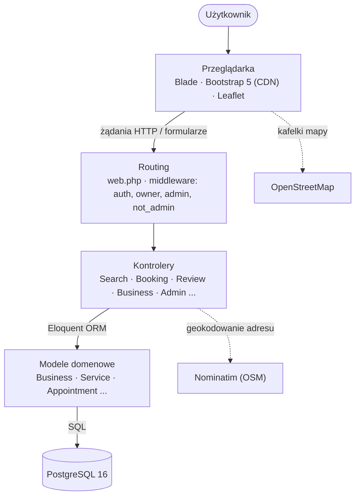

**Decyzje projektowe warte podkreślenia:**
- **`AvailabilityService`** - jedno miejsce liczące wolne terminy z godzin pracy, zajętych wizyt i urlopów; używane przez wyszukiwarkę, kreator rezerwacji i zmianę terminu.
- **Sortowanie ważone (bayesowskie)** - najpopularniejsze lokale liczone wzorem `WR = (v/(v+m))·R + (m/(v+m))·C`, dzięki czemu pojedyncza ocena 5,0 nie przebija lokalu z wieloma opiniami.
- **Zatwierdzanie lokali (`is_approved`)** - nowy salon czeka na akceptację administratora; niezatwierdzony jest niewidoczny publicznie.
- **Dwuetapowy upload zdjęć opinii** - najpierw zapis opinii, potem osobny upload pliku (omija problem niemożności odtworzenia pola `file` po błędzie walidacji).
- **Egzekwowanie czarnej listy** - klient dodany do czarnej listy lokalu nie umówi tam wizyty.
- **`day_of_week` w konwencji ISO (1–7, pon–niedz)** - spójnie w całym liczeniu dostępności.

## 4. Model danych

Schemat zdefiniowano w migracjach (`database/migrations`) i modelach Eloquent. Poniżej tabele pogrupowane funkcjonalnie; relacje wiele-do-wielu realizują tabele pośredniczące.

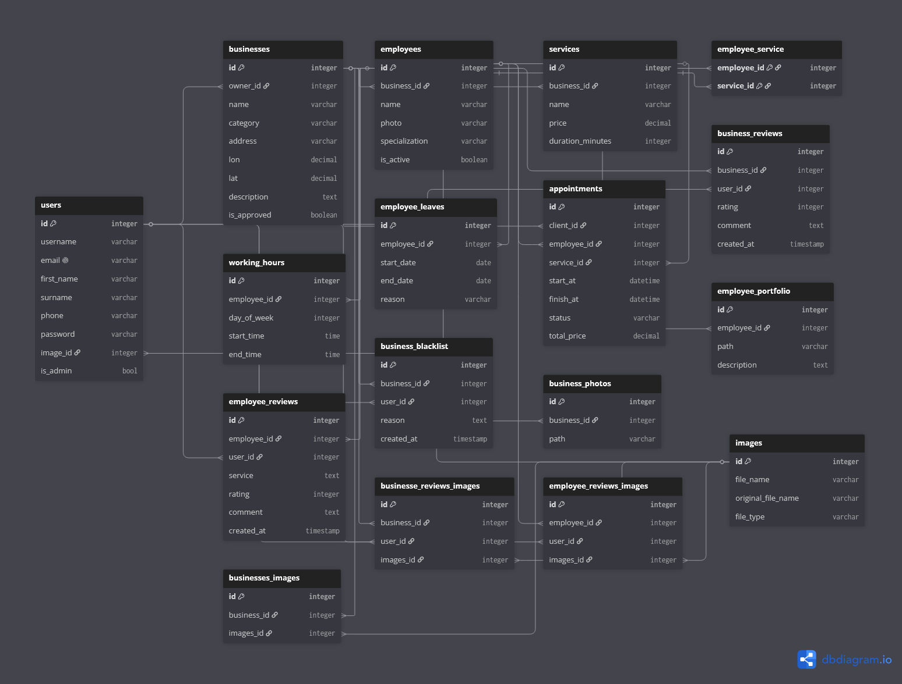
*Rys. 1: Diagram związków encji (ERD).*

## 5. Wyszukiwarka usług

Wyszukiwarka (`/szukaj`) działa **na poziomie usług**, a nie lokali - wynik to konkretna usługa w danym salonie wraz z wejściem do rezerwacji.

- **Wyszukiwanie** po nazwie usługi lub nazwie lokalu oraz po lokalizacji (adresie).
- **Filtry:** kategoria, cena (od/do), **zakres dat** (od/do), **zakres godzin**, minimalna ocena, **obszar mapy** („szukaj w tym widoku").
- **Sortowanie:** trafność, cena rosnąco/malejąco, najwyżej oceniane, **popularność** (średnia ważona).
- **Paginacja** z zachowaniem filtrów w adresie URL.
- **Dostępność:** po wybraniu zakresu dat usługi bez wolnych terminów są **ukrywane**, a przy pozostałych pokazywana jest liczba wolnych terminów.
- **Mapa OSM** z pinezkami znalezionych lokali (klik → przejście do strony lokalu).

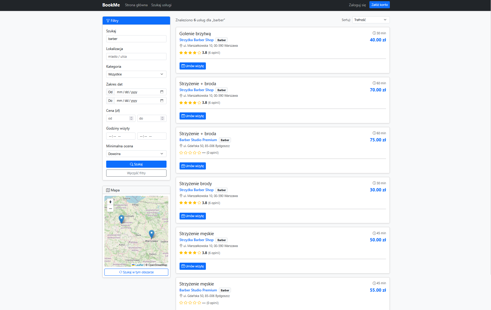
*Rys. 2: Wyszukiwarka - filtry, lista wyników i mapa OSM.*

## 6. Rezerwacja wizyty

Rezerwacja to **trzykrokowy kreator**:

```
1. Usługa  ──►  2. Termin (dostępność pracowników)  ──►  3. Potwierdzenie  ──►  zapis wizyty
```

- **Krok 2** pokazuje każdego specjalistę razem z jego wolnymi godzinami wybranego dnia - klik w godzinę przenosi od razu do potwierdzenia.
- Wolne terminy liczone są z **godzin pracy** pracownika, po odjęciu **zajętych wizyt** i **urlopów**, z pominięciem terminów przeszłych.
- Zapis poprzedza **walidacja serwerowa**: pracownik wykonuje usługę, termin mieści się w godzinach pracy, slot jest wolny, nie jest przeszły, a klient nie jest na **czarnej liście** lokalu.
- W panelu klienta („Moje wizyty") wizytę można **anulować** lub **zmienić termin** (wybór nowego wolnego slotu).

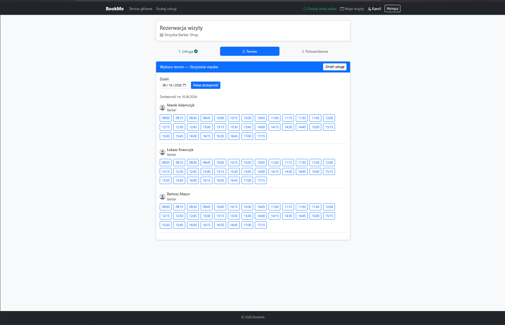
*Rys. 3: Krok wyboru terminu - dostępność per specjalista.*

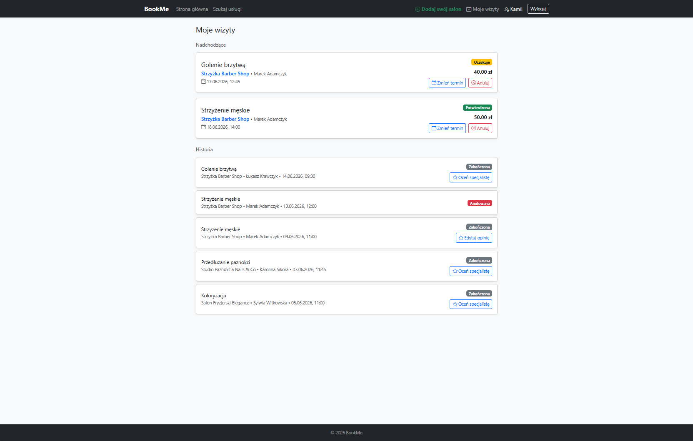
*Rys. 4: Panel klienta - nadchodzące i minione wizyty (anulowanie, zmiana terminu).*

## 7. Opinie i zdjęcia

- **Opinię o lokalu** dodaje każdy zalogowany użytkownik bezpośrednio na stronie lokalu (edytowalna).
- **Opinię o pracowniku** wystawia klient **po odbytej wizycie** (status `completed`) z poziomu „Moich wizyt".
- Oceny zasilają średnie wyświetlane w wyszukiwarce, na stronie głównej i na stronie lokalu.
- **Zdjęcia** dodaje się **dwuetapowo**: najpierw zapis opinii (gwiazdki + komentarz), potem osobny upload pliku. Zdjęcie jest powiązane z autorem (`user_id` w pivocie) i pokazywane pod właściwą opinią, z **podglądem w oknie modalnym**.

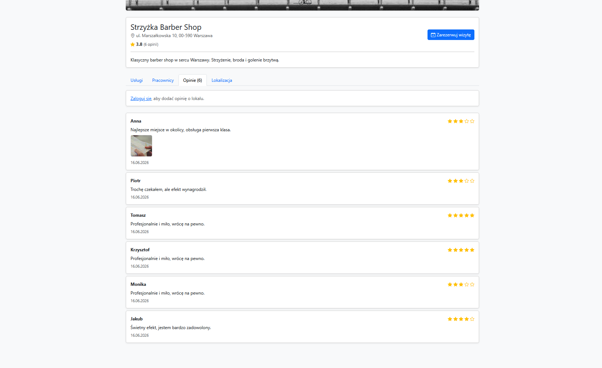
*Rys. 5: Strona lokalu - opinie z miniaturami zdjęć.*

## 8. Role i panele

### 8.1. Panel właściciela
Zarządzanie salonem: dane lokalu (z mapą OSM i geokodowaniem Nominatim), **usługi**, **pracownicy**, **godziny pracy**, **urlopy**, **galeria** i **portfolio**, **czarna lista** oraz **kalendarz wizyt** ze zmianą statusu rezerwacji. Nowy lokal trafia do **weryfikacji** administratora.

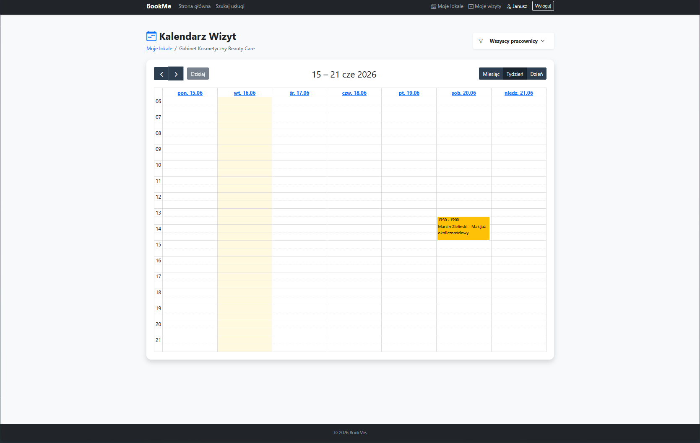
*Rys. 6: Panel właściciela - kalendarz wizyt.*

### 8.2. Panel administratora
Zatwierdzanie/odrzucanie zgłoszonych lokali, edycja i usuwanie lokali, zarządzanie **użytkownikami** oraz moderacja **opinii**.

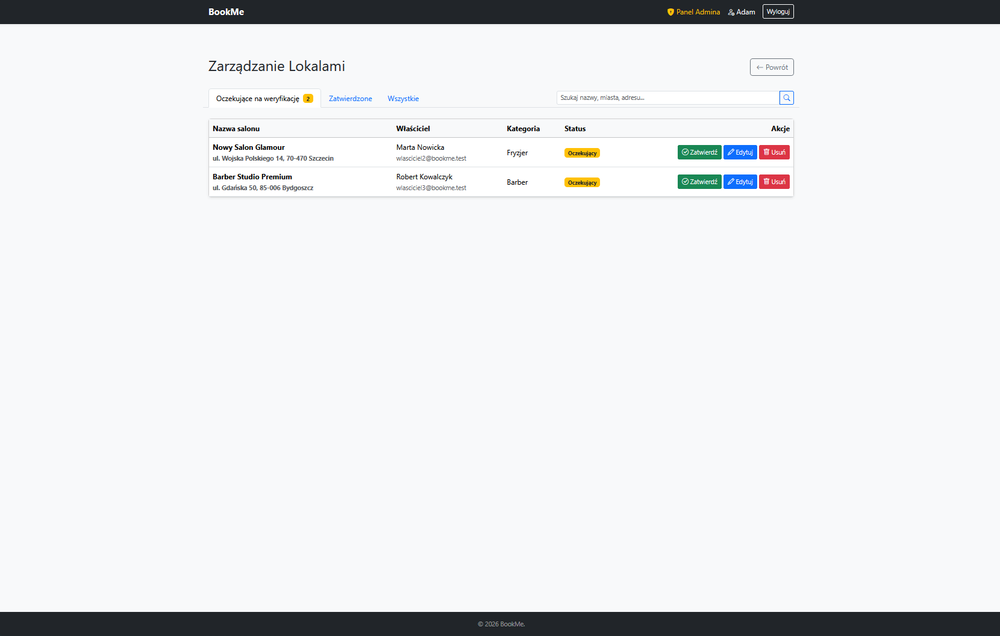
*Rys. 7: Panel administratora - zatwierdzanie lokali.*

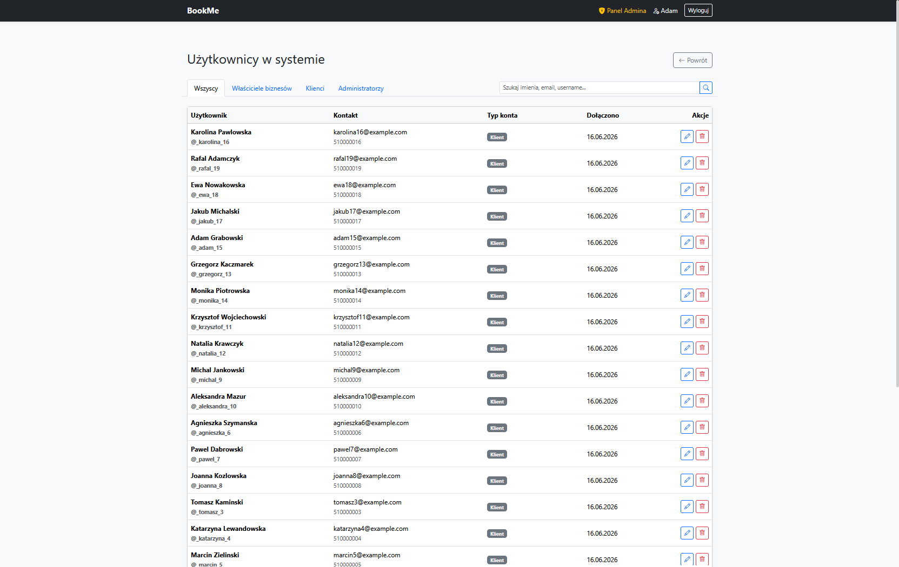
*Rys. 8: Panel administratora - użytkownicy.*

## 9. Przegląd aplikacji
Pełen przebieg umawiania wizyty przez klienta.

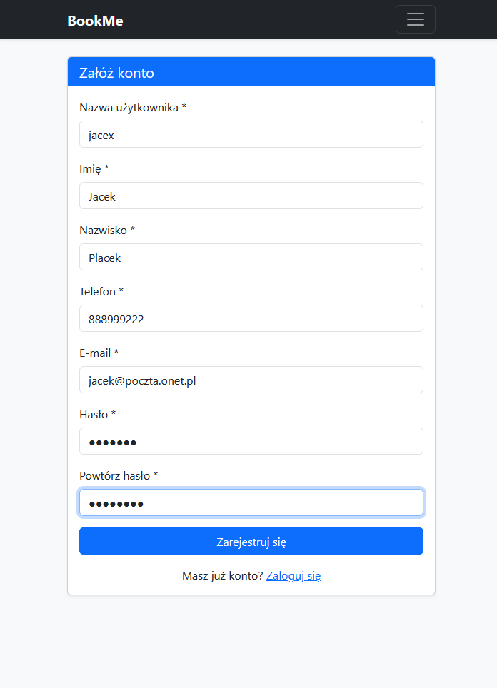
*Rys. 9: Rejestracja użytkownika ``jacex``.*

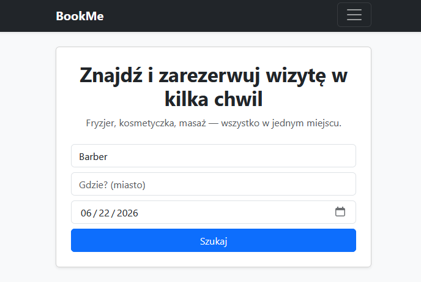
*Rys. 10: Strona główna - wpisanie szukanej usługi w pole szukaj i wybranie daty.*

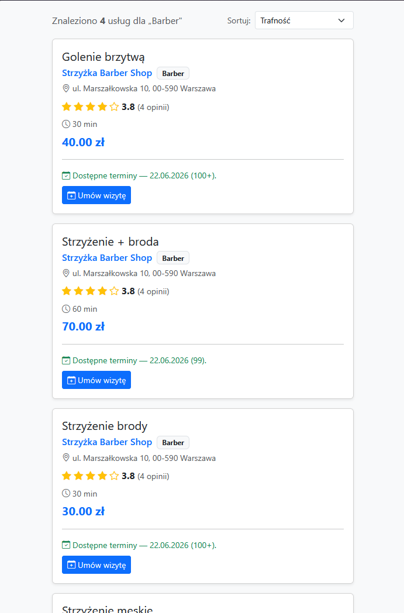
*Rys. 11: Wyszukiwarka - lista dostępnych usług spełniających nasze filtry, wybór interesującej nas opci.*

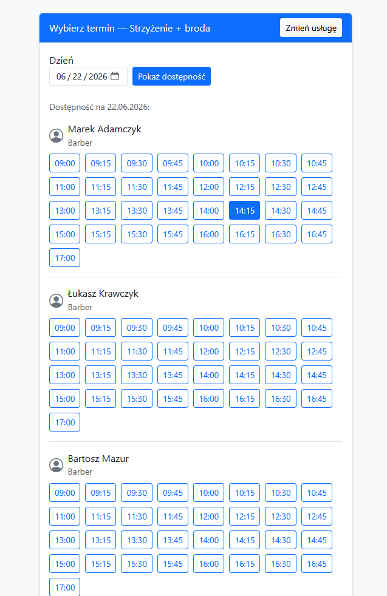
*Rys. 12: Bookowanie terminu - wybór pracownika i godziny usługi.*

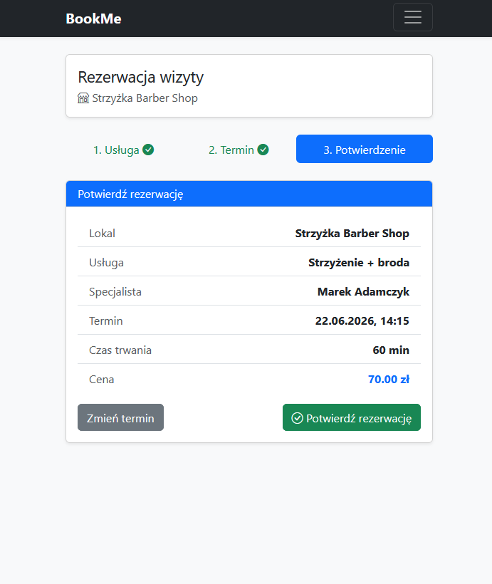
*Rys. 13: Bookowanie terminu - potwierdzenie wybranych opcji.*

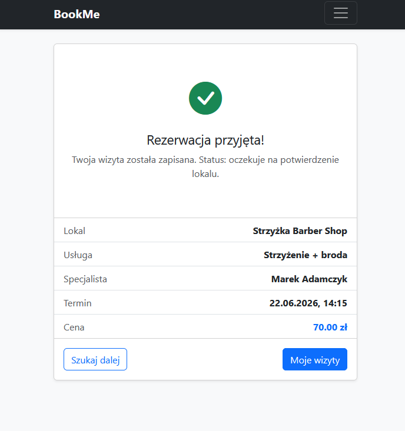
*Rys. 14: Bookowanie terminu - informacja zwrotna o przyjęciu bookingu.*

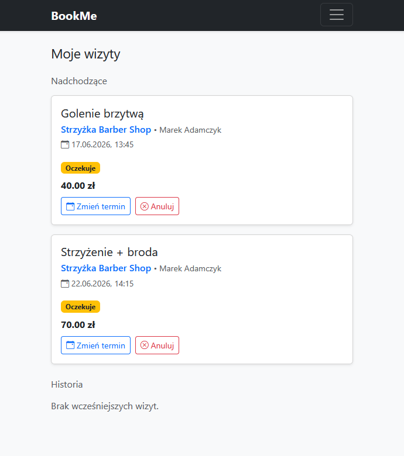
*Rys. 15: Wizyty klienta - lista historii oraz nadchodzących wizyt klienta.*

## 10. Instalacja i uruchomienie

Projekt uruchamia się w **Dockerze**. Środowisko stawia trzy usługi: aplikację Laravel (`app`), bazę PostgreSQL (`db`) oraz pgAdmin.

**Wymagania:**
- **Docker** + **Docker Compose** (zalecane: Docker w Ubuntu/WSL),
- dostęp do internetu przy pierwszym starcie (Composer, kafelki map, seed zdjęć).

**Uruchomienie:**
```bash
docker compose up --build
```
Przy starcie kontenera `app` (skrypt `docker/entrypoint.sh`) wykonują się automatycznie:
1. instalacja zależności Composera i `php artisan key:generate`,
2. **migracje** bazy danych,
3. `php artisan storage:link` (udostępnienie zdjęć),
4. **seedery** (realistyczne salony, pracownicy, usługi, wizyty, opinie i pobrane zdjęcia),
5. start serwera.

**Adresy:**
- Aplikacja: `http://localhost:8000`
- pgAdmin: `http://localhost:5050`

> Pełne, czyste przeładowanie danych demonstracyjnych:
> ```bash
> docker compose exec app php artisan migrate:fresh --seed
> ```

**Konta testowe** (hasła jak niżej):

| Rola | E-mail | Hasło |
|------|--------|-------|
| Administrator | `admin@admin.com` | `admin` |
| Właściciel (lokale + oczekujący) | `wlasciciel@bookme.test` | `password` |
| Właściciel (zatwierdzony + oczekujący) | `wlasciciel2@bookme.test` | `password` |
| Właściciel (lokal w weryfikacji) | `wlasciciel3@bookme.test` | `password` |
| Klient | `klient@bookme.test` | `password` |

## 11. Konfiguracja

| Miejsce | Znaczenie |
|---------|-----------|
| `docker-compose.yml` | definicje usług `app`, `db`, `pgadmin` i portów |
| `docker/entrypoint.sh` | sekwencja startowa: migracje → `storage:link` → seed → serwer |
| `.env` (`DB_HOST=db`, `DB_DATABASE=bookme`, ...) | połączenie z bazą i ustawienia aplikacji |
| `config/app.php` (`timezone`, `locale`) | strefa `Europe/Warsaw`, język interfejsu |

## 12. Ograniczenia

- **Środowisko w Dockerze/WSL:** komendy `php artisan`, `composer`, `docker compose` uruchamiane są w kontenerze, nie bezpośrednio na hoście.
- **Brak resetu hasła i weryfikacji e-mail:** funkcje świadomie pominięte - logowanie i rejestracja działają bez nich (zmiana hasła dostępna w ustawieniach konta).
- **Mapy i geokodowanie:** wymagają internetu (OpenStreetMap, Nominatim).
- **Zdjęcia demonstracyjne:** seeder pobiera obrazy z internetu (picsum.photos), więc pierwszy seed wymaga połączenia; bez sieci dane wgrają się bez zdjęć.
- **Notacja godzin pracy:** `day_of_week` w konwencji ISO (1 = poniedziałek … 7 = niedziela).

## 13. Scenariusze testowe

### 13.1. Rejestracja i logowanie
1. Zarejestruj konto (poprawny numer telefonu - 9 cyfr) i zaloguj się z opcją „Zapamiętaj mnie".
2. Sprawdź, że nawbar pokazuje imię i link do ustawień konta.

### 13.2. Wyszukiwanie i rezerwacja
1. Na `/szukaj` wpisz np. „strzyżenie", ustaw zakres dat i sprawdź filtrowanie, sortowanie i mapę.
2. Kliknij „Umów wizytę", przejdź kreator (usługa → termin → potwierdzenie) i zapisz rezerwację.
3. W „Moich wizytach" zmień termin i anuluj inną wizytę.

### 13.3. Opinie i zdjęcia
1. Jako klient z **odbytą** wizytą wystaw opinię o specjaliście i dodaj zdjęcie.
2. Na stronie lokalu dodaj opinię o lokalu i zdjęcie; sprawdź podgląd w modalu.

### 13.4. Panel właściciela
1. Zaloguj się jako `wlasciciel2@bookme.test`.
2. Dodaj/edytuj usługę i pracownika, ustaw godziny pracy i urlop.
3. W kalendarzu zmień status wizyty na `completed` i sprawdź, że klient może ją ocenić.

### 13.5. Panel administratora
1. Zaloguj się jako `admin@admin.com`.
2. Zatwierdź lokal oczekujący na weryfikację i sprawdź, że pojawia się publicznie.
3. Przetestuj wyszukiwarki użytkowników i lokali oraz moderację opinii.

## 14. Podział pracy

| Zakres | Osoba |
|--------|-------|
| Strona klienta i odkrywanie: strona główna, **wyszukiwarka usług** (mapa OSM), strona lokalu, **kreator rezerwacji**, panel klienta, **opinie ze zdjęciami**, ustawienia konta | **Radosław Misiołek (134950)** |
| Biznes i administracja: panel właściciela (dashboard, **kalendarz wizyt**), CRUD lokalu/pracowników/usług, godziny pracy, **urlopy**, **czarna lista**, **panel administratora**, zatwierdzanie lokali, obsługa zdjęć | **Wiktor Zięba (134992)** |
